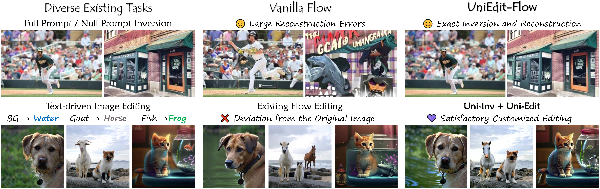
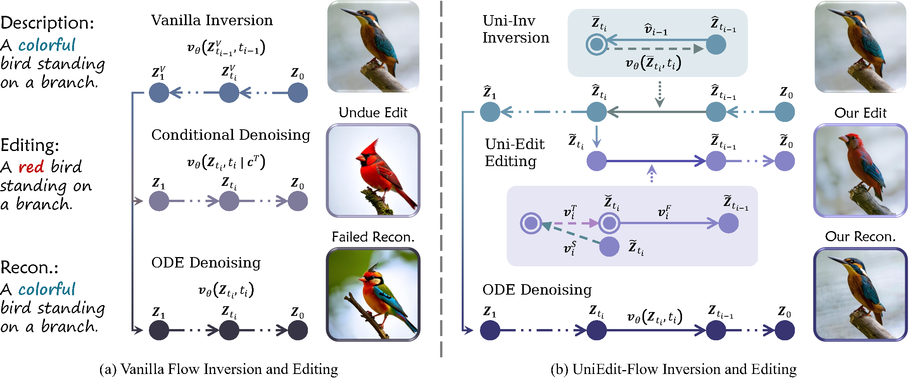
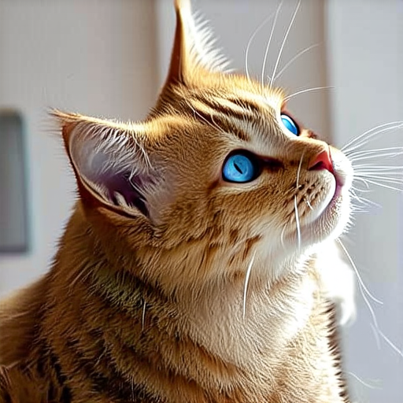
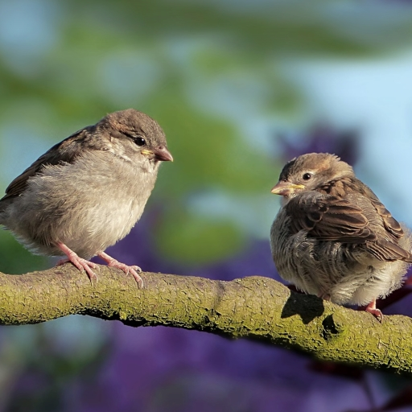
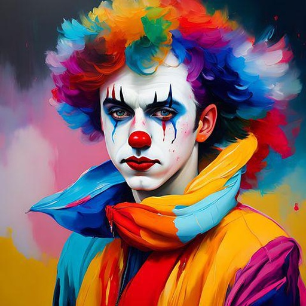
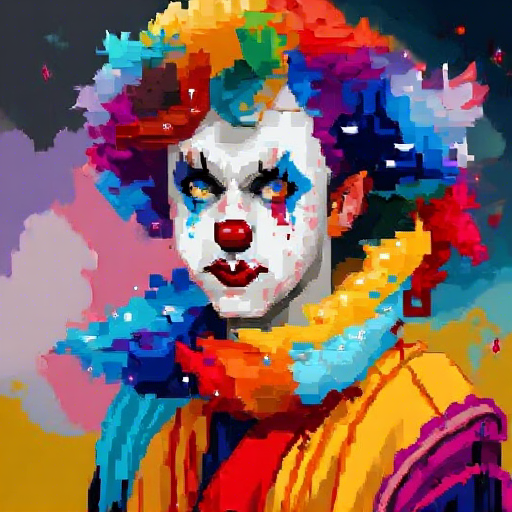
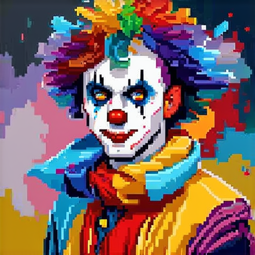

<div align="center">

<h1> <span style="color: rgb(141, 133, 229);">UniEdit-Flow</span> <br> Unleashing Inversion and Editing in the Era of Flow Models </h1>

Guanlong Jiao<sup>1,3</sup>, Biqing Huang<sup>1</sup>, [Kuan-Chieh Wang](https://wangkua1.github.io/)<sup>2</sup>, [Renjie Liao](https://lrjconan.github.io/)<sup>3</sup>

<sup>1</sup>Tsinghua University,  <sup>2</sup>Snap Inc.,  <sup>3</sup>The University of British Columbia

[](https://arxiv.org/abs/2504.13109)
<a href='https://uniedit-flow.github.io/'></a>
<!-- [](https://huggingface.co/)  -->
</div>

</div>

<div class="has-text-centered">
    
</div>

> TL;DR: A ***highly accurate and efficient, model-agnostic, training and tuning-free*** sampling strategy for inversion and editing tasks. Support text-driven image 🎨 (FLUX, Stable Diffusion 3, Stable Diffusion XL, etc.) and video 🎥 (Wan, flow-based video generation model) editing.

<!-- <br>
<h1> 📝 News </h1> -->

<h1> 💜 Overview </h1>
<div class="columns is-centered">
    <div class="has-text-justified">
        <p>
            In this work, we introduce a predictor-corrector-based framework for inversion and editing in flow models. 
            First, we propose <b>Uni-Inv</b>, an effective inversion method designed for accurate reconstruction.
            Building on this, we extend the concept of delayed injection to flow models and introduce <b>Uni-Edit</b>, a region-aware, robust image editing approach.
            Our methodology is <b><i style="color: rgb(141, 133, 229);">tuning-free, model-agnostic, efficient, and effective</i></b>, enabling diverse edits while ensuring strong preservation of edit-irrelevant regions.
        </p>
    </div>
</div>
<div class="columns is-centered">
    <div class="has-text-centered">
        
    </div>
</div>


<h1> ✨ Feature: Text-driven Image / Video Editing </h1>

More results can be found in our project page.

<h2> 🎨 Image Editing </h2>
<table class="center">
<tr>
  <td width=20% align="center">Editing Prompt</td>
  <td width=20% align="center">Source Image</td>
  <td width=20% align="center">FLUX</td>
	<td width=20% align="center">Stable Diffusion 3</td>
  <td width=20% align="center">Stable Diffusion XL</td>
</tr>
<tr>
  <td width=20% align="left">A <s>long</s> <b>short</b> haired cat <u><b>with blue eyes</b></u> looking up at something.</td>
  <td width=20% align="center"></td>
  <td width=20% align="center"></td>
	<td width=20% align="center"></td>
  <td width=20% align="center"></td>
</tr>
<tr>
  <td width=20% align="left">Two <u><b>origami</b></u> birds sitting on a branch.</td>
  <td width=20% align="center"></td>
  <td width=20% align="center"></td>
	<td width=20% align="center"></td>
  <td width=20% align="center"></td>
</tr>
<tr>
  <td width=20% align="left">A clown <u><b>in pixel art style</b></u> with colorful hair.</td>
  <td width=20% align="center"></td>
  <td width=20% align="center"></td>
	<td width=20% align="center"></td>
  <td width=20% align="center"></td>
</tr>
</table>


<h2> 🎥 Video Editing </h2>
<table class="center">
<tr>
  <td width=20% align="center">Editing Prompt</td>
  <td width=20% align="center">Source Video</td>
  <td width=20% align="center">Wan + Uni-Edit</td>
</tr>
<tr>
  <td width=20% align="left">A young rider wearing full protective gear, including a black helmet and motocross-style outfit, is navigating a <s>BMX bike</s> <b>motorcycle</b> over a series of sandy dirt bumps on a track enclosed by a fence...</td>
  <td width=20% align="center"></td>
  <td width=20% align="center"></td>
</tr>
<tr>
  <td width=20% align="left">A <s>koala</s> <b>cat</b> with thick gray fur is captured mid-motion as it reaches out with its front paws to climb or move between tree branches, surrounded by lush green leaves and dappled sunlight in a forested area.</td>
  <td width=20% align="center"></td>
  <td width=20% align="center"></td>
</tr>
</table>


<h1> 👨‍💻 Implementation </h1>

Here we provide two implementation options:
- [Implementation by diffusers](./UniEdit-Flow_diffusers/README.md): Support FLUX (e.g., `black-forest-labs/FLUX.1-dev`), Stable Diffusion 3 (e.g., `stabilityai/stable-diffusion-3-medium`), Stable Diffusion XL (e.g., `SG161222/RealVisXL_V4.0`), etc., for text-driven image editing tasks. As well, support Wan (e.g., `Wan-AI/Wan2.1-T2V-1.3B-Diffusers`) for text-driven video editing tasks.
- [Implementation on official FLUX repository](./UniEdit-Flow_FLUX/README.md): Implementation based on original FLUX. The performance is slightly better than the diffusers-based FLUX pipeline.


<h1> 🔮 Acknowledgements </h1>

We sincerely thank [FireFlow](https://github.com/HolmesShuan/FireFlow-Fast-Inversion-of-Rectified-Flow-for-Image-Semantic-Editing), [RF-Solver](https://github.com/wangjiangshan0725/RF-Solver-Edit), and [FLUX](https://github.com/black-forest-labs/flux) for their awesome work!
Additionally, we would also like to thank [PnpInversion](https://github.com/cure-lab/PnPInversion) for providing comprehensive baseline survey and implementations, as well as their great benchmark.


<h1> 📑 Cite Us </h1>

If you like our work, you can cite our paper through the bibtex below. Thank for your attention!

```bib
@misc{jiao2025unieditflowunleashinginversionediting,
    title={UniEdit-Flow: Unleashing Inversion and Editing in the Era of Flow Models}, 
    author={Guanlong Jiao and Biqing Huang and Kuan-Chieh Wang and Renjie Liao},
    year={2025},
    eprint={2504.13109},
    archivePrefix={arXiv},
    primaryClass={cs.CV},
    url={https://arxiv.org/abs/2504.13109}, 
}
```