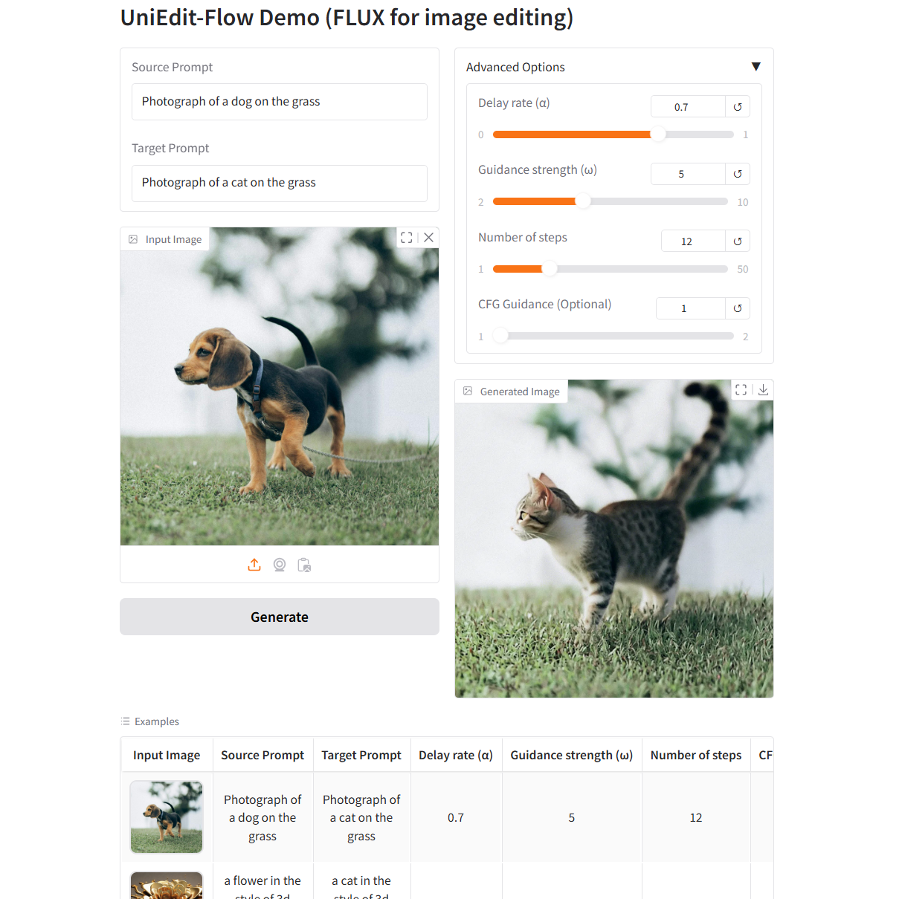

<div align="center">

<h1> 🏞️ UniEdit-Flow_FLUX </h1>

</div>

> The implementation of UniEdit-Flow based on official FLUX repository.


<h1> 🛠️ Environment </h1>

The environment of our code is the same as FLUX and FireFlow, you can refer to the [official FLUX repository](https://github.com/black-forest-labs/flux/tree/main) for more details.
You can run the following command to build the environment:

```shell
conda create -n unieditflow python==3.10
conda activate unieditflow

cd YOUR_WORKSPACE/UniEdit-Flow/UniEdit-Flow_FLUX
pip install -e ".[all]"
```


<h1> 🧪 Examples </h1>

You can run the following 💻 commands to perform image inversion and reconstruction or image editing:

```shell
cd YOUR_WORKSPACE/UniEdit-Flow/UniEdit-Flow_FLUX/src

# 🖼️ Image Inversion and Reconstruction 
# Null text of source_prompt and target_prompt is used for unconditional inversion and reconstruction, image description of source_prompt and target_prompt is used for conditional inversion and reconstruction.
python edit.py  --source_prompt [image description or null text] \
                --target_prompt [image description or null text] \
                --source_img_dir [your image path] \
                --output_dir [folder you want to save the results]
                --sampling_strategy 'uniinv' \
                --output_prefix 'uniinv' \
                --num_steps 30 \
                --alpha 1 \
                --omega 0 \
                --name 'flux-dev' \
                --guidance 1 \
                --inject 0 \
                --start_layer_index 0 \
                --end_layer_index 0

# 🎨 Image Editing
# We recommend alpha={0.6, 0.7, 0.75, 0.8}, omega=5.0, step={8, 10, 12, 15, 20, 30}.
# guidance could be {1.0, 1.5, 2.0}, inject, start_layer_index, and end_layer_index should be 0 for Uni-Edit.
python edit.py  --source_prompt [image description] \
                --target_prompt [description of your editing target] \
                --source_img_dir [your image path] \
                --output_dir [folder you want to save the results]
                --sampling_strategy 'uniedit' \
                --output_prefix 'uniedit' \
                --num_steps 15 \
                --alpha 0.6 \
                --omega 5.0 \
                --name 'flux-dev' \
                --guidance 1 \
                --inject 0 \
                --start_layer_index 0 \
                --end_layer_index 0
```


<h1> 🎡 Gradio GUI </h1>

You can also use the gradio GUI for easy image editing by running the following 💻 command:

```shell
python gradio_demo.py
```

Here we have provided some examples for users to have a fast test. There is a preview of the 🎡 GUI:

<div class="has-text-centered">
    
</div>
